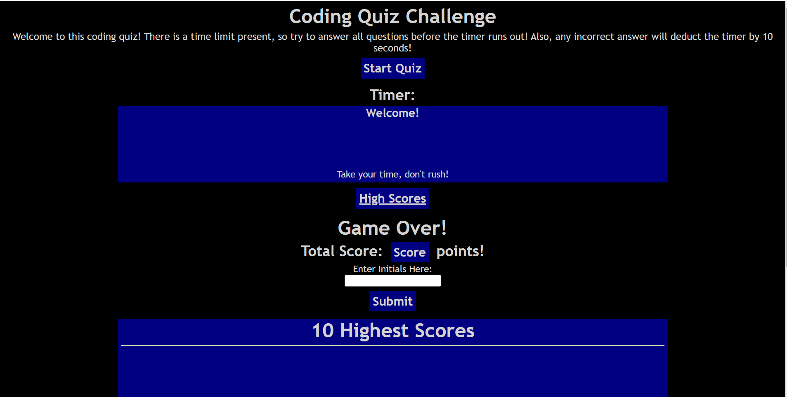

# Code-Quiz-Pedro-Guerra

## Description

In this bootcamp challenge, the main goal is to build on a code that involves HTML, CSS, and JavaScript files in order to create a timed quiz. This quiz will have to have a customization where that for each incorrect answer that is recorded, an amount of time from the total time given is shaved off. For example, if the total timer starts at 100 seconds, and there are 10 questions, if three questions are answered incorrect, that is an automatic 30 second deduction, aside from any time used to answer the questions.

## Installation

N/A

## Usage

This challenged allowed me to improve my JavaScript, HTML, and CSS coding skills. This was a challenging assignment since we had to start from nothing and utilize a lot of different commands to create a timed quiz.

Deployed Website Link: <a href="https://pguerra98.github.io/password-generator-pedro-guerra/">Coding Quiz</a>

## Credits

GA Tech bootcamp activities.

## License

MIT License.